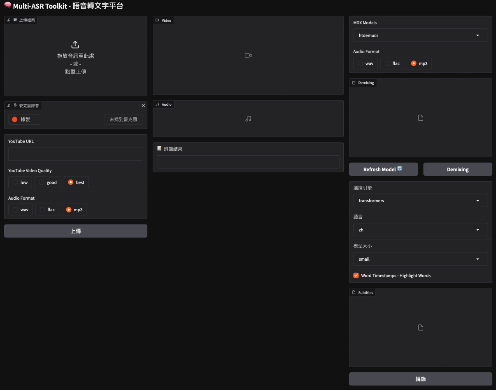

# Multi-ASR Toolkit

Multi-ASR Toolkit is a flexible and extensible speech recognition toolkit supporting multiple backend engines such as Whisper, Faster-Whisper, WhisperX, SpeechRecognition, and Vosk. It provides both a command-line interface and a web-based interface via Gradio, facilitating easy transcription of audio files using various ASR models.



## Requirements

- Python 3.10 or higher
- Gradio requires Python 3.10 or higher.
- pygame
- pydub
- [ffmpeg](https://ffmpeg.org/): for convert mp3 to wav
- [PyTorch](https://pytorch.org/get-started/locally/) 2.1+, [TensorFlow](https://www.tensorflow.org/install/pip?hl=zh-tw) 2.6+
- [transformers](https://github.com/huggingface/transformers?tab=readme-ov-file)
- [SpeechRecognition](https://github.com/Uberi/speech_recognition)
- [Whisper](https://github.com/openai/whisper)
- [Faster Whisper](https://github.com/SYSTRAN/faster-whisper)
- [MLX Whisper](https://github.com/ml-explore/mlx-examples/tree/main/whisper)
- [demucs](https://github.com/adefossez/demucs/tree/main)
- [yt-dlp](https://github.com/yt-dlp/yt-dlp)

## Install

1. Python packages

    ```bash
    $ pip3 install -r requirements.txt
    ```

2. ffmpeg

    ```bash
    # Ubuntu
    $ sudo apt install ffmpeg

    # Mac
    $ brew install ffmpeg
    ```

    For `Windows`, you can refer to this website: [ffmpeg install](https://github.com/adaptlearning/adapt_authoring/wiki/Installing-FFmpeg)

## Usage

### Using through command line interface (CLI)

```bash
# python app.py --mode cli <wav/mp3 file> 
$ python app.py --mode cli data/test.mp3 

# python app.py --mode cli <wav/mp3 file> --backend <asr backend> --language <language> --model-size <model size>
$ python app.py --mode cli data/test.mp3 --backend faster-whisper --language en --model-size base
```

### Using through web application (made with `Gradio`)

```bash
$ python3 app.py
```

## ❓Tips & Tricks

### YT=DLP Authentication Error

- Open a new incognito/private window and log in to your YouTube account.
- In the same tab, open https://www.youtube.com/robots.txt, ensuring that only this tab is using the login session.
- Use a browser extension (e.g., "cookies.txt" for Chrome) to export the youtube.com cookies for this session to a file named cookies.txt, and then immediately close the incognito window.
- Using the manually exported cookies.txt in Python.
    
    Place your cookies.txt in a fixed path, and then specify it in ydl_opts like this:

    ```python
    ydl_opts = {
    'format': 'bestvideo[ext=mp4]+bestaudio[ext=m4a]/mp4',
    'outtmpl': filepath,
    'verbose': True,          # 用于调试，正式可去掉
    'merge_output_format': 'mp4',
    'cookies': '<Path>/youtube_cookies.txt',
    }
    ```
#### reference: [yt-dlp/wiki/Extractors](https://github.com/yt-dlp/yt-dlp/wiki/Extractors)

### Demucs part and usage

- I just copied the demucs folder from the [demucs](https://github.com/adefossez/demucs/tree/main) repo into the backends folder.

- [Demucs APIs docs](https://github.com/adefossez/demucs/blob/main/docs/api.md)


## 🙏 Reference

- [abus-aikorea/kara-audio](https://github.com/abus-aikorea/kara-audio)
